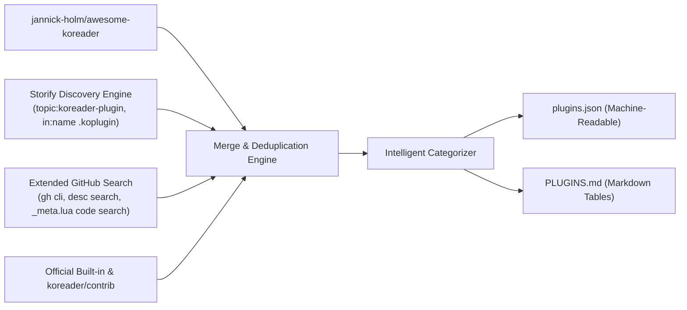

> **This project is not maintained.**

# Awesome KOReader 🚀

[](PLUGINS.md)
[](plugins.json)
[](PLUGINS.md)
[](PLUGINS.md#user-patch-collections)
[](LICENSE)
[](https://github.com/fusuyfusuy/awesome.koreader/pulls)

A comprehensive, automated, deduplicated master registry and architectural reference for **[KOReader](https://github.com/koreader/koreader)** plugins, user patches, and companion ecosystem tools.

---

## 📖 Quick Links

- 📋 **[Full Categorized Plugin Directory (PLUGINS.md)](PLUGINS.md)** — All 1,126 plugins & tools with stars, authors, descriptions, and source tags.
- 💾 **[Machine-Readable Database (plugins.json)](plugins.json)** — Complete JSON dataset for scripts, parsers, and custom in-app stores.
- ⚙️ **[How This Catalog Was Created](#-how-this-repository-was-created)** — Automated discovery, scraping, and crawling pipeline.
- 🔍 **[KOReader Discovery Architecture](#-koreader-plugin-discovery-architecture-storify--appstore)** — Deep dive into how in-app plugin stores (`storify.koplugin`) discover, parse, match, and update plugins.
- 🙏 **[Credits & Attribution](#-credits--acknowledgments)** — Honoring the original `awesome-koreader` project and upstream contributors.

---

## 📊 Catalog Overview & Category Breakdown

```
Total Tracked Entries: 1,126
├── 🔌 Plugins (Official, Community, Contrib): 1,011
├── 🧩 User Patch Collections & Tweaks: 111
└── 🖥️ Companion Tools & Sync Servers: 4
```

| Category | Count | Highlight Examples |
| :--- | :---: | :--- |
| **[🛠️ Utilities & Workflow Tools](PLUGINS.md#utilities-workflow-tools)** | `552` | Terminal emulators, text/code editors, QR clipboards, HTTP inspectors, folder locks |
| **[🧩 User Patch Collections](PLUGINS.md#user-patch-collections)** | `111` | User patch scripts and visual mod suites for KOReader's patch loader |
| **[🔄 Sync, Cloud & File Transfer](PLUGINS.md#sync-cloud-file-transfer)** | `77` | Syncthing, Nextcloud, WebDAV, LocalSend, Tailscale, Dropbox, WireGuard, Calibre sync |
| **[✍️ Notes, Highlights & Flashcards](PLUGINS.md#notes-highlights-flashcards)** | `66` | Highlights export to Obsidian, Anki, Notion, Readwise, Joplin, Flomo, Telegram |
| **[🎮 Games & Entertainment](PLUGINS.md#games-entertainment)** | `65` | Chess, Sudoku, Solitaire, Sokoban, 2048, Crosswords, Frotz interactive fiction |
| **[🖼️ UI, Themes & Customization](PLUGINS.md#ui-themes-customization)** | `43` | Custom home screens (ProjectTitle, SimpleUI, Zen UI), custom menus, screensavers |
| **[🤖 AI & Intelligent Assistants](PLUGINS.md#ai-intelligent-assistants)** | `38` | LLM reading assistants (Claude, GPT, Ollama, DeepSeek, Gemini, X-Ray) |
| **[📚 Book Discovery & Library Catalogs](PLUGINS.md#book-discovery-library-catalogs)** | `37` | OPDS catalogs, Z-Library, Zotero, Calibre content server, automated book downloaders |
| **[🎨 Comics, Manga & Graphic Novels](PLUGINS.md#comics-manga-graphic-novels)** | `32` | Panels+, Rakuyomi manga fetcher, dual-page mode, CBZ/CBR enhancers |
| **[⚡ Hardware, Device & Controls](PLUGINS.md#hardware-device-controls)** | `30` | Bluetooth gamepads/remotes, frontlight automation, battery monitors, hardware keys |
| **[🌐 Dictionaries & Translation](PLUGINS.md#dictionaries-translation)** | `25` | Offline neural translation, StarDict pre-loaders, multilingual lookup, Japanese furigana |
| **[📰 RSS & Read-It-Later](PLUGINS.md#rss-read-it-later)** | `20` | QuickRSS, Wallabag, Instapaper, Readeck, Omnivore |
| **[📊 Reading Stats, Tracking & Goals](PLUGINS.md#reading-stats-tracking-goals)** | `18` | Reading timers, streaks, gamification (ReadMastery), speed analytics |
| **[📖 Reading & Typography](PLUGINS.md#reading-typography)** | `8` | Vertical text rendering (Tategumi), reading rulers, speed reading, autoturn |
| **[🖥️ Companion Tools & Sync Servers](PLUGINS.md#companion-tools-sync-servers)** | `4` | Desktop dashboards (KoInsight, KoHighlights), self-hosted sync backends |

👉 **Browse the full catalog with links and star counts in [PLUGINS.md](PLUGINS.md)**.

---

## 🛠️ How This Repository Was Created

This master catalog was created by analyzing the decentralized discovery engine implemented in **`storify.koplugin`** (KOReader AppStore) and executing an automated, multi-tier crawler across GitHub and curated community indexes:



### Discovery Channel Breakdown

| Discovery Channel | Total Matches | Exclusive Matches | Method Description |
| :--- | :---: | :---: | :--- |
| **🔍 Storify Native Methods** | **`790`** | **`442`** | Native queries implemented in `storify.koplugin` (`.koplugin` suffix, `koreader-plugin` topic, and user-patch queries). |
| **🚀 Extended GitHub Search (`gh` / API)** | **`482`** | **`185`** | Full-text description searches, hyphenated repo names (`koreader-plugin-*`), and `_meta.lua` code searches. |
| **📦 Official KOReader Repositories** | **`123`** | **`38`** | Core plugins shipped inside `koreader/koreader` (36) + `koreader/contrib` catalog (87). |
| **⭐ Awesome-KOReader Curated List** | **`52`** | **`11`** | Manually curated list from [`jannick-holm/awesome-koreader`](https://github.com/jannick-holm/awesome-koreader). |

### Self-Updating Catalog via GitHub Actions (technique reference)

The catalog was designed to refresh itself with no server or maintainer in the loop: [`.github/workflows/update.yml`](.github/workflows/update.yml) runs [`.github/scripts/crawl.py`](.github/scripts/crawl.py) and commits `plugins.json`/`PLUGINS.md` back to `main` only when the crawl actually produces a diff (`git diff --staged --quiet` guards the commit/push step so a no-op run doesn't create empty commits). This is a reusable pattern for any repo that wants to stay current against an external data source without external infrastructure — checkout, run your generator, commit-if-changed, push, all inside the Action's own `GITHUB_TOKEN` permissions.

The workflow is kept in the repo as a reference for that technique, but is **not scheduled** — this project is unmaintained, so it only runs if someone triggers it manually from the Actions tab (`workflow_dispatch`).

---

## 🔍 KOReader Plugin Discovery Architecture (Storify / AppStore)

Understanding how KOReader in-app package managers (`storify.koplugin` / `appstore.koplugin`) discover, parse, match, install, and update plugins is essential for plugin authors:

### 1. Decentralized GitHub Crawler
`storify.koplugin` runs on-device without a centralized backend server. It queries the GitHub REST API v3 using targeted search patterns:
- **Plugins:** `topic:koreader-plugin fork:false`, `in:name ".koplugin" fork:false`, and fork queries with `stars:>=1`.
- **User Patches:** `topic:koreader-user-patch` and `in:name "KOReader.patches"`.
- **Git Tree Scanning:** For multi-plugin or patch repositories, queries `/repos/{owner}/{repo}/git/trees/{branch}?recursive=1` to index individual `.lua` patch files and nested `.koplugin` folders.

### 2. Plugin Manifest Standard (`_meta.lua`)
Every standard KOReader plugin resides in a folder ending in `.koplugin` (e.g. `plugins/syncthing.koplugin/`) and includes a sandboxed `_meta.lua` manifest:
```lua
local _ = require("gettext") -- or appstore_gettext

return {
    name = "syncthing",                  -- Internal folder identifier
    fullname = _("Syncthing Client"),    -- Human-readable name (supports l10n)
    description = _([[Sync books and notes over Syncthing.]]), 
    version = "1.2.0",                  -- Semver (X.Y.Z) or Date-based (YYYY.MM.DD)
}
```

### 3. Local-to-Remote Matching Engine
The matching engine (`core/appstore_matcher.lua`) matches on-disk plugins against GitHub repositories through a 4-tier waterfall:
1. **Direct Record Match:** Saved `owner/repo` from previous install record.
2. **Exact Directory Match:** `dirname == repo.name` or `dirname == repo.name .. '.koplugin'`.
3. **Display Name Match:** `manifest.name == repo.name` (case-insensitive).
4. **Canonical Slug Match:** Strips common prefixes (`koreader-plugin-`, `koreader-`, `plugin-`) and suffixes (`.koplugin`).

### 4. Versioning & Update Detection
- **SemVer & Date Parsing:** `core/appstore_version.lua` strips prefixes (`v`, `release-`), handles both SemVer (`1.2.3-beta.1`) and Calendar date versions (`2026.08.18` or `20260818`), and compares pre-release ranks (`alpha < beta < rc < release`).
- **Timestamp Fallback:** If versions cannot be parsed, release publication timestamps vs local file mtime (`latest_mtime`) determine update eligibility.

### 5. Safe Atomic Installation & Zip Slip Defenses
Package extraction (`core/appstore_installer.lua`) enforces strict security and data safety:
- **Zip Slip Traversal Defense:** Canonicalizes all entry paths and enforces `isSubPath(target_dir, dest_target)` before extraction.
- **Staging Directory:** Extracts into `.new` staging folder.
- **User Config Preservation:** Scans existing install directory and copies user config/setting files into `.new` with size verification before swapping.
- **Atomic Rename Rollback:** Renames `target -> .bak`, `staging -> target`, and rolls back on failure.

---

## 📦 How to Install Plugins in KOReader

### Method A: Automated Installation via Storify / AppStore (Recommended)
1. Install the [`storify.koplugin`](https://github.com/fusuyfusuy/storify.koplugin) into your KOReader `plugins/` directory.
2. Restart KOReader.
3. Open the top menu -> **Tools** -> **AppStore** to browse, search, install, and update plugins with one tap directly on your e-reader.

### Method B: Manual Installation
1. Download or clone the plugin repository.
2. Copy the `.koplugin` folder (e.g. `assistant.koplugin`) into the `plugins/` directory of your KOReader installation:
   - **Kindle:** `/mnt/us/koreader/plugins/`
   - **Kobo:** `/.kobo/koreader/plugins/`
   - **PocketBook:** `/mnt/ext1/system/koreader/plugins/`
   - **Android:** `/sdcard/koreader/plugins/`
   - **Linux / Desktop:** `~/.config/koreader/plugins/`
3. Restart KOReader to load the new plugin.

---

## 🙏 Credits & Acknowledgments

- **[Jannick Holm (`jannick-holm/awesome-koreader`)](https://github.com/jannick-holm/awesome-koreader)** — Sincere thanks to Jannick Holm for creating the original, hand-curated `awesome-koreader` repository that served as the foundational inspiration for community plugin curation.
- **[Omer Faruq (`omer-faruq/appstore.koplugin`)](https://github.com/omer-faruq/appstore.koplugin)** — Special thanks to Omer Faruq for creating the original **KOReader AppStore** project, pioneering the in-app plugin repository concept, manifest format, and decentralized discovery architecture for KOReader.
- **[Storify (`fusuyfusuy/storify.koplugin`)](https://github.com/fusuyfusuy/storify.koplugin)** — A modern fork and complete rewrite of the original AppStore concept, introducing multi-source recursive tree crawling, sandboxed manifest parsing, 4-tier local matching, and atomic swap installation.
- **[KOReader Team & Contributors](https://github.com/koreader/koreader)** — The creators and maintainers of the best open-source e-book reader software in the world.
- **[KOReader Contrib Index](https://github.com/koreader/contrib)** — Upstream repository of official and community-contributed plugins.

---

## 🤝 Contributing & Submitting Plugins

Want to add your plugin to this list?
1. Make sure your repository has:
   - The GitHub topic **`koreader-plugin`** (or **`koreader-user-patch`** for patches).
   - A valid `_meta.lua` manifest in the root or `.koplugin` folder.
2. Submit a Pull Request or open an Issue, or simply tag your repository on GitHub with `koreader-plugin` — the automated crawler will automatically pick it up during the next catalog build!

---

## 📄 License

This repository and catalog are released under the [MIT License](LICENSE).
Individual KOReader plugins listed in this catalog belong to their respective authors and are licensed under their respective terms.
